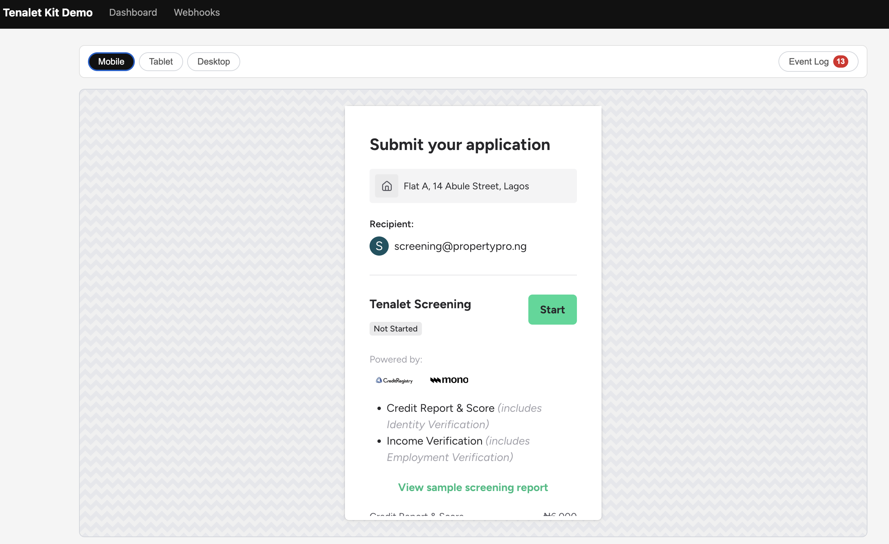

# ScreenKit Demo

Reference implementation for [ScreenKit](https://registry.scalar.com/@roofteller/apis/screenkit-api@latest). Demonstrates tolet creation, embedded tenant screening, report access, and webhook handling.



> For full API reference, embed SDK docs, and webhook schemas, see the **[ScreenKit API docs](https://registry.scalar.com/@roofteller/apis/screenkit-api@latest)**.

## Quick Start

**Prerequisites:** Node.js 18+ (uses native `fetch`)

```bash
git clone https://github.com/screenkit/kit-demo.git
cd kit-demo
npm install
cp .env.example .env
# Edit .env with your partner API key
npm start
```

Open [http://localhost:3500](http://localhost:3500) in your browser.

## How It Works

```
Browser (public/)              Express Server (server.js)              ScreenKit API
┌─────────────────┐           ┌──────────────────────────┐           ┌──────────────┐
│  Static HTML/JS  │──/api/*──▶  Proxy (adds API key)    │──/v1/*───▶│  api.screenkit│
│                  │◀─────────│                          │◀──────────│  .co          │
│  embed.js loaded │          │  /api/webhooks/screenkit │◀──webhook─│              │
│  from app URL    │          │  (signature verification) │           └──────────────┘
└─────────────────┘           └──────────────────────────┘
```

- **Express server** (`server.js`) proxies `/api/*` requests to the ScreenKit API (`/v1/*`), injecting your API key server-side so it's never exposed to the browser.
- **Static frontend** (`public/`) calls the local proxy using relative paths.
- **Webhook endpoint** at `/api/webhooks/screenkit` receives events with HMAC-SHA256 signature verification and stores them in memory.
- **Embed SDK** (`embed.js`) is loaded dynamically from ScreenKit's app URL to render the screening widget in an iframe.

## Pages

| Page | Path | Description |
|------|------|-------------|
| Dashboard | `/` | Create tolets, view listings, expand to see applications |
| Screen Tenant | `/screen.html?toletId=...` | Create application, load embed, view live event log |
| Reports | `/reports.html?applicationId=...` | View and download screening reports |
| Success | `/success.html` | Redirect landing after submission |
| Webhooks | `/webhooks.html` | Real-time webhook event viewer |

## Configuration

| Variable | Description | Default |
|----------|-------------|---------|
| `SCREENKIT_API_KEY` | Your partner API key (test or live) | — |
| `SCREENKIT_WEBHOOK_SECRET` | Webhook signature secret | — |
| `PORT` | Local server port | `3500` |

### Test vs Live keys

New partners start in **sandbox mode** with a test key (`tnlt_pk_test_...`). Test keys create sandbox data that doesn't affect production. When you're ready to go live, ask your ScreenKit admin to provision a live key (`tnlt_pk_live_...`).

The demo auto-detects the key mode and shows a **SANDBOX** or **LIVE** badge in the nav bar.

With a test key you can also drive a screening straight to generated reports — without filling in the widget by hand — via `POST /api/sandbox/screenings/:id/simulate`, which proxies the sandbox simulate endpoint and fires `application.reports_generated` just like a real submission.

Both the API URL (`https://api.screenkit.co`) and embed app URL (`https://app.screenkit.co`) are hardcoded in `server.js`. Edit them there if needed for local development.

## Webhook Testing

The demo server receives webhooks at `POST /api/webhooks/screenkit`. To test locally:

1. Set `SCREENKIT_WEBHOOK_SECRET` in your `.env` to match your partner account's configured secret.
2. Use a tunnel service (e.g., ngrok) to expose your local server:
   ```bash
   ngrok http 3500
   ```
3. Configure the tunnel URL as your webhook endpoint in the ScreenKit admin dashboard:
   ```
   https://your-tunnel.ngrok.io/api/webhooks/screenkit
   ```
4. Open [http://localhost:3500/webhooks.html](http://localhost:3500/webhooks.html) to see incoming events.

## Project Structure

```
kit-demo/
├── server.js              # Express server: API proxy, webhook handler, config endpoint
├── public/
│   ├── index.html         # Dashboard page
│   ├── screen.html        # Tenant screening page
│   ├── reports.html       # Reports viewer
│   ├── success.html       # Post-submission redirect
│   ├── webhooks.html      # Webhook event viewer
│   ├── css/               # Styles
│   └── js/
│       ├── api.js         # Shared API client (calls local proxy)
│       ├── dashboard.js   # Dashboard logic
│       ├── screen.js      # Screening + embed logic
│       ├── reports.js     # Report fetching/display
│       ├── success.js     # Success page logic
│       └── webhooks.js    # Webhook polling/display
├── docs/                  # Screenshots and assets
├── .env.example           # Environment template
├── package.json
├── LICENSE
└── README.md
```

## License

[MIT](LICENSE)
